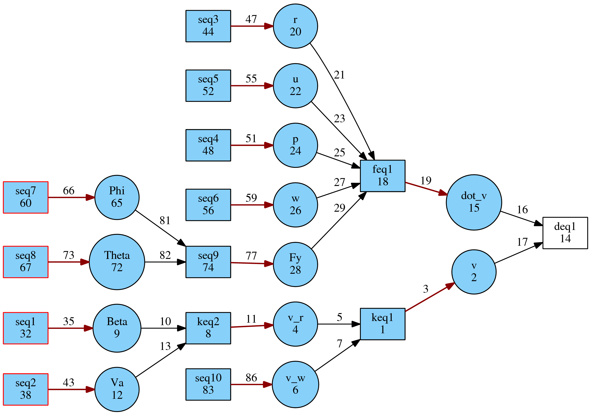
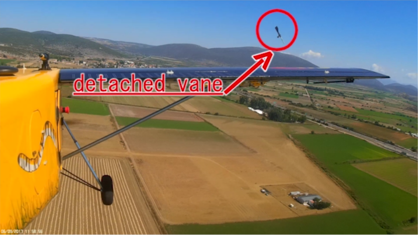
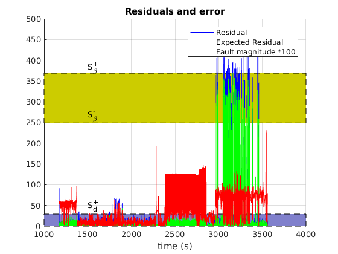

.. _chap-fault-response:

=========================
Estimating Fault Response
=========================

In linear systems, when a parity relation is found, and given a set of system inputs representing faults with known magnitude, it is easy to calculate the effect of said faults on the parity relation. In other words, it is easy to find the magnitude of the fault response of the residual signal.
And this needn't be with a numerical procedure; A closed-form formula can be found which describes the residual response under the influence of the maximum fault.
This response value is constant and can be subsequently used to select a threshold for the fault detection logic.

However, in non-linear systems, there are two complications:

Firstly, it is not always easy, or even possible to find a closed-form solution for the fault response level of a given parity relation, as it may involve piece-wise functions, non-linear algebraic equations systems or differential-algebraic equation systems.

Secondly, in a non-linear system, the fault response level at maximum fault may not be constant, but instead dependent on some systems variables. For example, a system variable multiplying the fault variable can "mute" the fault influence on the system. What is more, the maximum fault response of the residual may even not correspond to maximum fault magnitude. Stated differently, the sensitivity of the residual to the fault is variable.

Stemming for the second point, is the realization that for two different fault sources with the same worst-case value, the corresponding level of response of the residual may be of different scale for each fault.

For the above reasons, traditional approaches for fault response estimation do not work for general, non-linear systems.
Instead, this toolbox utilizes numerical methods (specifically Particle Swarm Optimization) to estimate the response of a residual to faults.

Case Study
==========

As a running example for this demonstration, we shall use a submodel of a fixed-wing UAV, incorporating the lateral motion quantities of velocity, airspeed, roll angle, acceleration and angle of sideslip. This is implemented in model ``g032a``, found in the graph pool of the toolbox.

It corresponds to an actual system, the UnATRaP UAV, the aerial testbed of our laboratory.

.. image:: unatrap.jpg

The UAV is equipped with an airdata boom, able to measure the angle of sideslip directly, and with an ArduPilot autopilot, which provides an estimate of the inertial and wind velocity.

.. image:: airdata_boom.png

The corresponding demo script is ``fault_response_demo.m``, which:

    1. Builds the system model and find the (unique) residual generator
    2. Implements the residual generator function using Matlab's symbolic and numerical solver tools
    3. Uses Particle Swarm Optimization to estimate the sensitivity of the residual signal to the faults it covers
    4. Parses logged data from a real flight, where a angle of sideslip measurement fault occurred and compares estimated and actual residual responses

Structural Analysis
===================

The system description can be found in the file ``g032a``, which includes not only the structural information, but the actual equation expresssions, e.g.

.. code-block:: matlab

    ...
    {'v v_r v_w expr -v+v_r+v_w'};...
    {'Beta v_r Va expr -v_r+sin(Beta)*Va'};...

These will later be used to implement the residual generator function.

Four faults are considered for this system:

    1. fseq1: angle of sideslip measurement fault
    2. fseq2: airspeed measurement fault
    3. fseq3: roll angle measurement fault
    4. fseq4: pitch angle measurement fault

Run the demo script ``fault_response_demo.m``. It is set to breaking operation, halting after each section, allowing better introspection.
The first part is structural analysis of the system. Once it is done, the system graph is constructed:

.. image:: sideslip_system.png

and a valid matching is found, leading to a residual generator

The white rectangle is the unmatched equation, the evaluation point of the residual signal.

Residual Implementation
=======================

The next section of the code is the implementation of the residual generator function. The toolbox parses the system equations, and solves them according to the partial ordering dictated by the matching. Analytical tools are used to perform solutions and substitutions. Where this is not possible, numerical tools are used.

The order of evaluations is output:

.. code-block:: matlab

    Sequence of calculations for the evaluation of the residual:
    Beta := 1.0*Beta_m + 1.0*fseq1
    Va := 1.0*Va_m + 1.0*fseq2
    v_w := 1.0*v_w_m
    r := 1.0*r_m
    u := 1.0*u_m
    p := 1.0*p_m
    w := 1.0*w_m
    Phi := 1.0*Phi_m - 1.0*fseq7
    Theta := 1.0*Theta_m - 1.0*fseq8
    v_r := 1.0*Va*sin(Beta)
    Fy := 1.0*m*(a_m_y + g*cos(Theta)*sin(Phi))
    v := 1.0*v_r + 1.0*v_w
    dot_v := 1.0*p*w + 1.0*r*u + (1.0*Fy)/m
    0 := (residual)

Fault Response Evaluation
=========================

Next, Particle Swarm Optimization is used to estimate the maximum influence of each fault onto the residual signal. It is assumed that only one fault occurs at a time.

The corresponding code is:

.. code-block:: matlab

    fault_response_vector_set = getFaultResponseVector( RG_results.res_gen_cell, [], [] ); % Run all tests, with no pre-calculated fault response vector

As we discussed at the beginning of this demonstration, the operational domain of the system plays a role in the fault response levels. Thus, the optimization must be aware of the domain of the system variables (in this case, the flight envelope of the UAV).
This is communicated with the script ``makeDictionary_g032a.m``, found in the same folder as the system model.

For example, the airspeed range is set from 20m/s to 35m/s with

.. code-block:: matlab

    graphInitial.setLimits([], {'Va_m'}, [20 35]);

and the airspeed measurement fault is constrained to 5m/s:

.. code-block:: matlab

    graphInitial.setLimits([], {'fseq2'}, [-5 5]);

This essentially sets the domain limits of the search of the Particle Swarm Optimization.

The optimization may take several minutes to finish. A non-linear residual generator function needs to be evaluated over a multi-variable search space and for four different fault variables/sources.

The final result is 

.. code-block:: matlab

    Final Fault Response Vector:
    264.0353    4.9024    0.3897    0.4598
    290.9532   35.3553    0.2901    0.0045

Let us go over what this array contains:

Each column corresponds to one of the measurement fault sources, angle of sideslip, airspeed, roll and pitch angle.

The lower row is the fault response of the residual **maximized** over the fault range and also **maximized** over the system variables range. This is the greatest fault response level that is expected to be reached for each of the fault sources.
Placing a detection threshold level above this value does not make sense, as the residual signal is not expected to rise above that value.

The upper row is the fault response of the residual **maximized** over the fault range but **minimized** over the system variables range. This value is the residual level corresponding to the worst-case fault, but also corresponding to the worst-case attenuation due to the system variables. This value is useful for assessing the worst-case performance of the diagnostic system.

Theoretically, every value of the top row should be lower than the corresponding value of the bottom row; the worst-case fault response should be lower than the best-case fault response. However, there are a few reasons why this contradictory result may appear:

    1. Local minima of the residual generator function have pulled the particles towards a non-optimal solution
    2. Fewer particles have been scattered in the search-space to reduce computational complexity, which led to a less-than-necessary coverage of the search-space
    3. In difficult optimization problems, the random nature of Particle Swarm Optimization cannot converge to the same, optimal result in every run

Sanitizing the Results
======================

Obviously, this result is wrong. The optimization needs to be run again, until the minimum fault response is lower than the maximum fault response.

The next section of the demo script is set to run the Particle Swarm Optimization once more:

.. code-block:: matlab

    fault_response_vector_set = getFaultResponseVector( RG_results.res_gen_cell, fault_response_vector_set, [] ); % Run all tests, with no pre-calculated fault response vector

This time, the previous fault response vector is passed onto the optimization routine. If a lower minimum / greater maximum response is found for any fault source, it will be used. If not, the old values will be preserved.

The new result is:

.. code-block:: matlab

    264.0353    4.9024    0.3897    0.0698
    335.3099   35.3553    0.7778    0.0519

Better limits were found for the minimum response of pitch angle measurement fault (4th column) and the maximum response of the angle of sideslip, roll angle and pitch angle measurement faults (1st, 3rd and 4th columns).

However, the results of the 4th column are still incompatible. One more run of the optimization returns.

.. code-block:: matlab

    194.5380    4.9024    0.3897    0.0412
    335.3099   35.3553    0.7943    0.1554

Lower bounds were found for the 1st and 4th column and a meaningful upper bound was finally found for the 4th column as well. This is a satisfactory result.

It should be noted that the true lower/upper bound value could be analytically found for most systems, but with painful calculations and derivations. Instead, here, we introduced an approach suitable for treating large-scale systems, with many residual generators and many faults, and obtaining at least some first-pass results.

Decoding the Fault Response Vector
==================================

Let us take a closer look at the contents of the fault response vector of the single residual generator of this system.

The first, most obvious observation is that the residual is an order of magnitude more sensitive to angle of sideslip measurement faults than airspeed measurement faults, and one more order of magnitude, compared to roll and pitch angle measurement faults.

This raises the suspicion that the residual signal will be practically insensitive to the last two faults, due to the unavoidable signal noise that will manifest in the diagnostic system.
Coversely, it is evident that this residual generator is most sensitive to angle of sideslip measurement faults.

Additionally, for the second column, the lower bound response is about 7 times lower than the maximum response, which means that even for the maximum airspeed measurement fault, the residual response will vary this much over the whole flight envelope.

Application on Real Flight Data
===============================

During one of our test flights, it so happened that the wind vane of the angle of sideslip worked itself loose.

Thanks to the redundant measurement sources of the autopilot system, we are able to measure the faulty measurement singal and also reconstruct an estimate of the true angle of sideslip.

.. image:: fault_response_beta.png

The airplane takes off at about t=1300, when the wind vane starts working and the estimated measurement error drops close to zero. Notice that the error is not exactly zero, due to various measurement noise sources.

At t=2400 the plane lands. The absence of a wind stream allows the angle of sideslip sensor to sit at a random position and the error grows large.

The airplane takes off again at t=2900 and the error drops once more, but at about t=3000 the wind vane breaks.
The measurement error now deviates from zero significantly more.

Note that the measured value of the angle of sideslip is frozen at a random value, but the actual quantity varies, so the error is not constant.

The residual signal, as the output of a function which is fed with the system measurements ( r=g(u,y) ) can be seen below in blue, with the fault overlayed for temporal reference.

The level of response of the actual, calculated residual is very close to the predicted value of 335. The reason it exceeds it is most likely due to the presence of other sources of error such as measurement noise which further build up the residual value.

In green, the value of the theoretical value of the residual is plotted, as a function of system state and fault ( r=h(x,f) ). If the optimization procedure was successful in finding the true maximum of the residual reponse, this should match the resopnse level exactly, which is the case.

As a final note, notice that even though the fault is non-zero around t=3050s and t=3500s, the residual response drops close to zero.
This seems contradictory and in violation to the assumption of exoneration, but is actually constistent with the underlying theory.

In close inspection, the residual value is dependent upon the fault and its derivative as well:

.. image:: residual_expression.png

This is also witnessed by the matched graph of the subsystem at the top of this document, which requires a differentiation of the variable *v*, which is subsequently subtracted from *dot_v*, with the residual as the remainder of this operation.

As a result, the residual value is much more dependent on the error derivative than the error itself. These intervals where the residual drops significantly is when the error is significant, but its derivative less so.
This is a topic which merits the attention of the diagnostic system designer when tackling dynamic residual generator functions.
