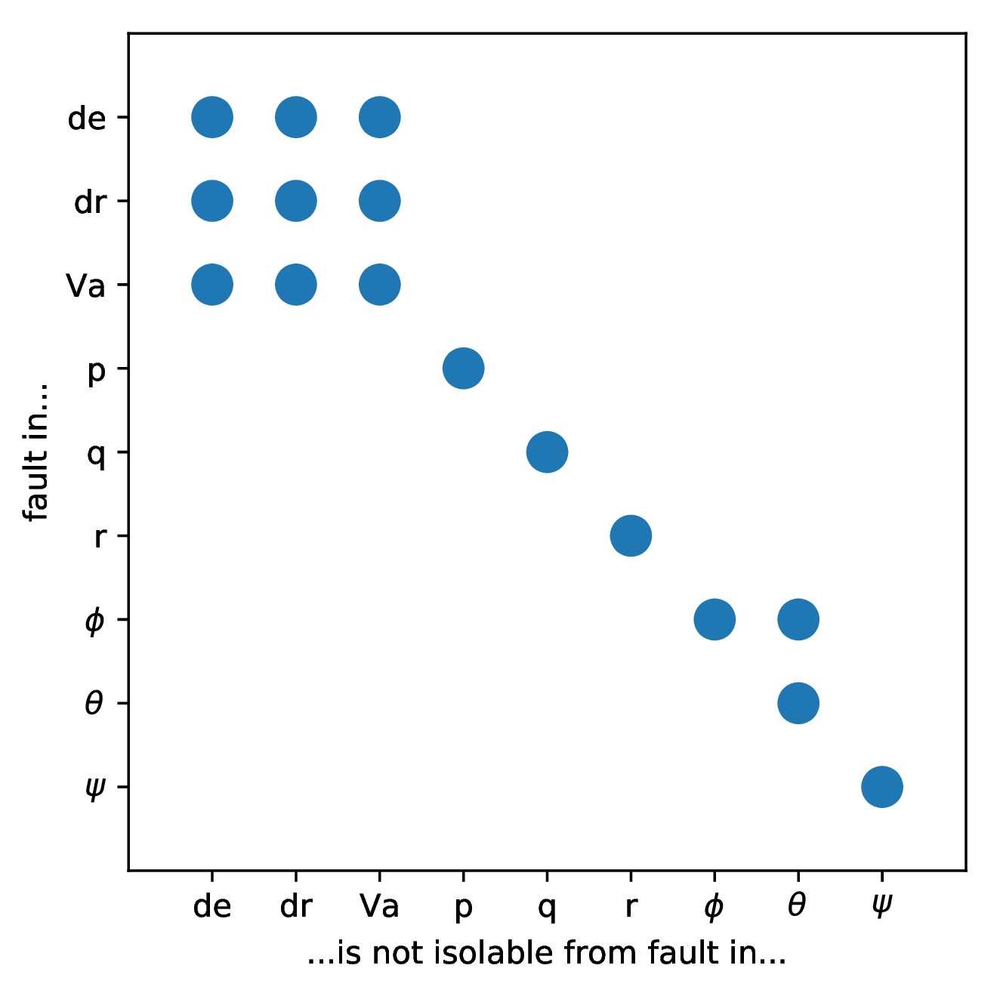
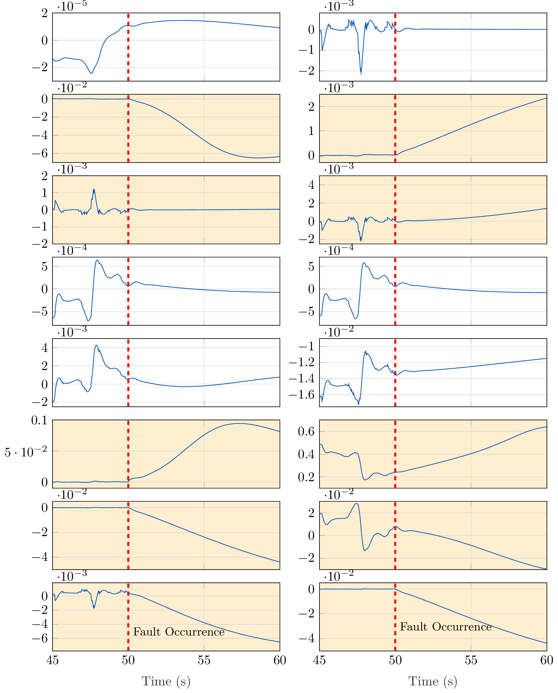

.. _chap-fwuav-fdi:

=============================================
Automated Fault Diagnosis in a Fixed-Wing UAV
=============================================

UAVs represent very tightly coupled subsystems with small time constants.
These obstacles make UAVs an especially challenging platform for Fault Diagnosis.
While fault diagnosis in other platforms focuses mostly on selecting the optimal subset from a large pool of available residual generators, in the case of UAVs merely populating such a pool with a sufficient number of residuals is a challenge.

To demonstrate this problem and also showcase how `fault-diagnosis` tackles the FDI problem,
we will use the model ''g041'', a fixed-wing UAV, taken from the book *Small Unmanned Aircraft* by Beard and McLain.

All actuators and the sensors for angular velocities (p, q, r), Euler angles (φ, θ, ψ) and airspeed (Va ) are considered to be subject to faults.

This demo script will cover:

  1. Generating the structural model
  2. Extracting Proper Structurally Overdetermined (PSO) submodels for maximum fault isolation
  3. Finding realizable matchings for all PSOs, if possible
  4. Implementing corresponding residual generator functions for each matching
  5. Loading a dataset containing data of a flight under fault and calculating the residual signals.

Running the Test Script
=======================

Structural Analysis
-------------------

Simply execute the ``fwuav_fdi.m`` script, located in the ``Demos`` folder. It will take about 3.5 minutes to finish, depending on your machine.

Let's go over the script, step by step.

.. code-block:: matlab

    % Select the MAVLink model for processing
    model = g041(); % Fixed-wing aircraft, modeled after Beard/McLain's Small Unmanned Aircraft Book

    [...]

    %% Perform Structural Analsysis and Matching, extract residual generators
    SA_results = structural_analysis(model, SA_settings);

Initially, the model description is loaded and Structural Analsysis is performed.
35 PSOs are generated and an optimal, realizable matching is sought for each one.
The ''SA_results'' structure contains the results.

.. code-block:: matlab

    % Inspection: Display the total number of residual generators found
    counter = 0;
    for i=1:length(SA_results.matchings_set)
        for j=1:length(SA_results.matchings_set{i})
            if ~isempty(SA_results.matchings_set{i}(j))
                counter = counter + 1;
            end
        end
    end

A sanity check is performed, to count the non-empty matching sets; some PSOs may very well have no realizable solution.
The following output occurs::

    Matching Statistics for system g041 with method BBILP2:
    ================================================
    Number of PSOs with non-empty matchings: 25/35
    Average PSO size: 20.7429
    Number of resulting non-empty matchings: 25
    Mean matching size: 20.56

Unfortunately, matching sets for only 25 PSOs were available.
This will affect the isolability capabilities of our diagnostic system.

Detectability and Isolability analyses are run:

.. code-block:: matlab

    %% Do detectability analysis

    % Create the Fault Signature Matrix and related information
    FSStruct = generateFSM(SA_results.gi, SA_results.res_gens_set, SA_results.matchings_set);

    fprintf('Faults not covered:\n');
    SA_results.gi.getExpressionById(SA_results.gi.getEquations(FSStruct.non_detectable_fault_ids))

    %% Do isolability analysis

    % Create the Isolation Matrix and related information
    IMStruct = generateIM(SA_results.gi, FSStruct);
    plotIM(IMStruct);
    title('Ideal Isolability Matrix');

The resulting Isolability Matrix is

.. image:: ism_before.png

Faults 1 and 3, affecting the throttle and elevator inputs are not detectable at all.

Residual Generator Implementation
---------------------------------

.. code-block:: matlab

    RG_settings.dt = 0.01;  % Select the time step, if needed

    tic
    RG_results = get_res_gens(SA_results, RG_settings);

The discovered matching sets are then implemented. A time step of 0.01 seconds is selected, to reflect the flight log sampling rate.

However, MATLAB's symbolic toolbox was not able to implement all of the residuals.
Notably, it had the most difficulty in solving systems of simultaneous algebraic equations.
Other symbolic algebra pakages, such as *SymPy* may fare better.

In the end only 16 residual generators could be implemented, 50% of which represent dynamic systems (include an ODE or a DAE).

The actual isolation matrix becomes:

Application on a Flight Log
---------------------------

Let us now run a dataset of a flight log through this bank of residual generators.
The dataset was created by our `last_letter simulator <https://github.com/Georacer/last_letter>`_ based on the ROS framework.
The mathematical model of this example was inserted.
A fault in the gyroscope x-axis was simulated: at t=50s the gyro reading freezes.

A bag file was captured and the measured timeseries were extracted as ''.csv'' files, in order to parse them in MATLAB.
The data was resampled and aligned, in order to pass them to the residual generator bank.

The bank of residual generators can process the datalog offline or online:

.. code-block:: matlab

    % Initialize residual generators
    for i=1:length(RG_results.res_gen_cell)
        rg = RG_results.res_gen_cell{i};
        if ~isempty(rg)
            rg.reset_state(RG_results.values);
        end
    end

    % Evaluate the residuals
    RE_results = evaluateResiduals(SA_results, RG_results, data_resampled);  % Evaluate the residual generator bank

The residual timeseries are plotted, here with focus on the time interval around the fault.

The fault occurrence is marked with a verticla red line and the residuals which are sensitive to it have an orange background.

The residuals which do not depend on the fault do not increase in magnitude after the fault occurrence.
On the other hand, almost all of the relevant residuals are quite sensitive to the fault with the exception of the one in row 3, column 1.
This is a known shortcoming of Structural Analysis when employed for Fault Diagnosis.
Because of the qualitative abstraction, the residual generators are only nominally sensitive to the faults they cover, in the sense that the fault variables appear in the residual generator expression.
However, the fault contribution on the residual signal cannot be quantified, especially in such non-linear and dynamic systems.